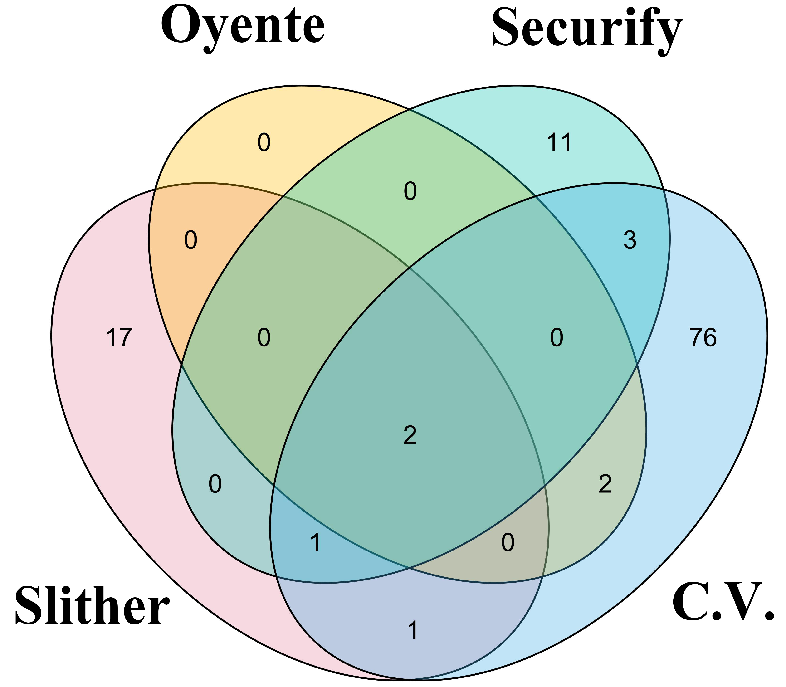

###########
Evaluations
###########

In our paper, we decribe the capability of detection unique true positive vulnerabilities by showing a venn graph.

Obviously, our proposed tool, Clarivoyance, can cover most real vulnerability except 28 ones found by other tools (17 of Slither, 11 of Securify). The reasons can be categorized into three: 

1.  Inheritable *internal* vulnerable function. Solidity function use functional modifiers to limit the viewability of outer callers. As one of them, *internal* limit that the function can only be seen by functions have inheritable relations with. If a vulnerable function has such modifier, it can only be hacked theoretically. Because the attacked function must inheritate from the attack one, and we believe this means a trust relationship. So this case is exclued from Clarivoyance's capability.
2.  Misusing PPTs. 
3.  Bypassable permission control.

