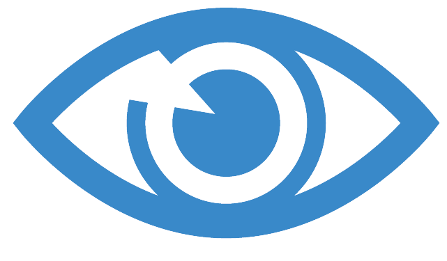

Clairvoyance
============

.. .. note::
..      **For responses, please see** Response_.

Static program analysis still plays a key role in detecting and fixing vulnerabilities (e.g., reentrancy) in smart contracts. However, the existing static analyzers still suffer from two major limitations: 

- lack of intra-contract analysis
- lack of path feasibility due to the techniques used by programmers to prevent reentrancy (e.g.,permission controls, hard-coded addresses and execution locks). 

In this work, we present Clairvoyance, a cross-function and cross-contract static analysis by identifying infeasible paths for detecting reentrancy vulnerabilities in smart contracts. 

.. note::
    To reduce FNs, we enable, for the first time, a cross-contract call chain analysis by tracking possibly tainted paths. To reduce FPs, we have conducted extensive empirical studies and summarized five major path protective techniques (PPTs) to support fast yet precise path feasibility checking.

We have implemented our approach and compared Clairvoyance with three state-of-the-art approaches on **17770** real-worlds contracts. Results show that Clairvoyance yields the best detection accuracy among all tools and also finds **76** unknown reentrancy vulnerabilities. In addition, Clairvoyance is comparable to the fastest rule-based tool (i.e., Slither) in  analysis time, but significantly faster than verification-based tools Oyente and Securify.

In this website, we sample some vulnerable smart contract code which are pointed out by Clairvoyance and show our exploits. Each exploit consists of the metadata of contract (e.g. transaction count, ethers it involved), the exploit code and concise explanations. Exploits will be continuously updated in the future.

.. _Response:

Supplementary Materials:
---------------------

1.  **FPs Overlapping**

Please see `FP Venn Diagram <https://toolman-demo.readthedocs.io/en/latest/fp_venndiagram.html>`_

2.  **Our Dataset**

We publish the dataset which has been used in our empirical study and evaluations in `empirical study data <https://drive.google.com/file/d/1JO1zd5JquDuAeWWh3uEvcsh8ItSx8jBW/view?usp=sharing>`_ (11714 contracts) and `evaluation data <https://drive.google.com/file/d/1WeU3TjdAn40cOyU51M7mHzF7KOHLC4Y6/view?usp=sharing>`_ (17770 contracts). Both dataset are crawled from Ethereum block chain by accessing the Etherscan API with smart contract deployment addresses. The addresses are supported by `Google BigQuery public dataset <https://cloud.google.com/blog/products/data-analytics/ethereum-bigquery-public-dataset-smart-contract-analytics>`_. The datasets with 11714 and 17770 contracts are small parts of it.

3.  **F1 Score of Tools**

To compare the tools used in experiment and assess their effectiveness intuitively, we calculate the f1 scores and list them in the following table. 

+-----------+----------+----------+----------+--------------+
+-----------|  Slither |  Oyente  | Securify | Clairvoyance |
+-----------+----------+----------+----------+--------------+
| Precision |  1.85%   |  14.28%  |  0.49%   |    73.80%    |
+-----------+----------+----------+----------+--------------+
|  Recall   |  2.45%   |   3.27%  |  2.45%   |    100.0%    |
+-----------+----------+----------+----------+--------------+
| F1 Score  |  2.10%   |   5.32%  |  0.81%   |    84.92%    |
+-----------+----------+----------+----------+--------------+

.. 1.  **Response to reviewer's on 74 TPs of Clairvoyance**

.. The 76 real world vulnerabilities found by Clairvoyance is published in `Google Drive <https://drive.google.com/file/d/1wpDYHV_velfbA-Y_pPH79gT_ljiQxoKR/view>`_. And we provide 20 influential smart contract expolits, all of which are programed by our expert and tested by `Remix IDE <https://remix.ethereum.org/>`_. They are listed in the followings.

Artifacts:
----------

In considieration of reproducibility, the source code is open-sourced at `Google Drive <https://drive.google.com/file/d/1UAorwSCJvJRQqZiE_5J3hNRc6HCde2Lm/view>`_. We also provide brief installation introductions in README.doc. 

Precisions and Case Studys:
------------------------

.. toctree::
    :maxdepth: 1

    fp_venndiagram.rst
    attack_01.rst
    attack_02.rst
    attack_03.rst
    attack_04.rst
    attack_05.rst
    attack_06.rst
    attack_07.rst
    attack_08.rst
    attack_09.rst
    attack_10.rst
    attack_11.rst
    attack_12.rst
    attack_13.rst
    attack_14.rst
    attack_15.rst
    attack_16.rst
    attack_17.rst
    attack_18.rst
    attack_19.rst
    attack_20.rst

.. 2.  **Response to reviewer's on the implicit evaluations**

.. In our paper, we decribe the capability of detection unique true positive vulnerabilities by showing a venn graph.

.. .. image:: venn.png
..     :width: 400px
..     :align: center

.. Obviously, our proposed tool, Clarivoyance, can cover most real vulnerability except 28 ones found by other tools (**17 of Slither, 11 of Securify**). The reasons can be categorized into three: 

.. 1.  Inheritable *internal* vulnerable function. Solidity function use functional modifiers to limit the viewability of outer callers. As one of them, *internal* limit that the function can only be seen by functions have inheritable relations with. If a vulnerable function has such modifier, it can only be hacked theoretically. Because the attacked function must inheritate from the attack one, and we believe this means a trust relationship. So this case is exclued from Clarivoyance's capability. We found 10 vulnerabilities in this case, **8** of them are reported by Securify and **10** of them are reported by Slither.

.. 2.  Misusing PPTs. In some cases, PPTs can miss the vulnerability. For example, our PPT1, the use of identity check before other operations, can lead us missing vulnerabilities because the check may contain irrelevant equations, which make the check useless to stop malicious investigators. In our observation, the misusing can happen when adopt PPT1-PPT3. In our work, we found 10 vulnerabilities misusing PPTs, **3** of them are from Securify and **7** of them are from Slither.

.. 3.  Bypassable permission control. Solidity functions have statements *require*, *assert* to verify equations. Part of these statements are used to permission control. But these equations may become ineffective due to weak conditions. After human auditing by our experts, we found **8** vulnerabilities in total. **5** of them are from Slither, and **3** of them are from Securify.

.. All of our cases mentioned above can be found in `Google Drive <https://drive.google.com/file/d/1yaOR-dTEeghyTuxYJa3QwS_2nQPWz4bi/view?usp=sharing>`_.